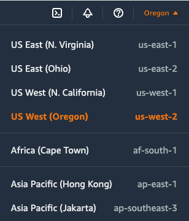

## Creating an AWS Account
- Skip to the **Creating a backup user in AWS** section below if you already have an AWS account. Otherwise, go to https://aws.amazon.com/ and click the "**Create an AWS Account**" option.
- This is fairly straightforward, but you'll need to provide a credit card or a payment method to have an account created
- An email will be sent to the sign-up email address when the account is created successfully
- The credentials provided as sign-up are for the root user in your AWS account and it should be treated and used just like any other root user on other systems. Enable multi-factor authentication (MFA) for this account for additional security


## Creating a User for Backups in AWS
- In this step, an AWS user will be created that will be used later to upload backups to AWS Glacier
- If not already signed in to AWS, go to https://aws.amazon.com/ , click the "**Sign In to the Console**" option, and sign in as the root user
- At the Console Home, type "**IAM**" in the main search field and then select "**IAM - Manage access to AWS resources**"
- In the "**IAM Dashboard**" left navigation menu, select "**Users**". Click the "**Add Users**" button.
- Enter a user name value . A user name value of "backup" is probably good enough for this case.
- For the "**Select AWS credential type**", enable the "**Access key - Programmatic access**" option.
- This is not needed here, but optionally, if you want the "backup" user to be able to login through the web console, enable the "Password - AWS Management Console access" option. There are options to enter a password or use an auto generated one. There is also an option to require that the password be reset at next sign-in, useful if you are delegating the backups to someone else
- Click **Next** and skip the permissions page for now without assigning the "backup" user to groups or permissions.
- Click **Next** and skip the optional tags page
- Click **Next**. On the review page there may be a warning about the user having no permissions. Ignore this for now and click the "**Create user**" button to create the user
- A summary page will be displayed that has the "backup" user's "**Access key ID**" and "**Secret access key**". These should be saved to your password manager application/service as they will be used later
- Click the "**Close**" button to return to the "**Users**" menu.
- Click the username of the user created above from the list. This should display the user's "**Summary**" page.
- Copy and note down the "**User ARN**" value. This will be used in later sections

## Backups/Retrievals with AWS Glacier
- As mentioned before, AWS Glacier should be used as a last resort offsite cloud storage solution
- With **AWS Glacier API-Only**, backups won't show up instantly in the Vaults. In fact, it will take anywhere from several hours up to 24 hours after upload for them to show up there
- An object *may* not be available for download for several hours after a request to retrieve it from an **AWS Glacier API-Only** Vault or an **AWS S3 Glacier** Bucket is made
- The reason for this delay is what happens behind the scenes when a request to retrieve an object is made. After a request to retrieve an item is made, it gets copied to an S3 storage node where it can be downloaded from. This process takes time, unless the option to expedite the process is chosen, which costs more. The user also has anywhere between 12 hours to a few days to retrieve the item from the S3 storage node
- A **Simple Notification Service (SNS)** can be set up to send a notification when an item is ready for retrieval. This eliminates the need for having to check often whether the item is ready to be retrieved.
- Setting up SNS is explained in the next section

## AWS Regions
- The Simple Notification Service (SNS) and the AWS Glacier Vault or Bucket must be created in the same AWS region.
- Normally you'd want to select the closest cheapest region to you
- Refer to https://aws.amazon.com/s3/pricing/ AND  https://aws.amazon.com/s3/glacier/pricing/ for the different regional pricing for AWS Glacier
- Regions can be selected from the top-right corner of the AWS GUI console, next to the account name.
- Note down the name that has no spaces of the region where your Vault/Bucket and SNS will be created in. This will be needed later. For example, in the following image it's the name that shows up on the right column such as **us-west-2**, **af-south-1** , etc.. 

## Simple Notification Service (SNS) - Optional but Highly Recommended
- While logged in to the AWS console as the root user, under the "**Application Integration**" section of "**Services**" select **(Simple Notification Service), SNS** . Or type "**SNS**" in the main search field
- Make sure to select the same Region from the top right corner where the AWS Glacier service will be created
- The "**Publisher**" in this case will be Glacier, which will send a notification to the SNS topic when a retrieval is ready. That in turn could notify subscribers, which among other things, can be set to be an email address.
	- Click on "**Start with an overview**" in the SNS page
	- Click the number under "**Topics**" to list the existing topics. Then click the "**Create topic**" button
	- Select "**Standard**" as the topic type. Give it a descriptive name, e.g: GlacierTopic. The rest can be left with the default values
	- In the resulting screen, create a subscription by clicking the "**Create subscription**"
		- Choose "**Email**" for the Protocol, with the email address in the "**Endpoint**" input area
		- Leave the rest as defaults, and then select the "**create subscription**" button
		- A message is sent to the email address with a confirmation link, so confirm the subscription once the email is received
		- Note down the topic ARN since it will be used later. This usually starts with "**arn:aws:sns:**......"


## Install the AWS CLI Tools
- Navigate to https//aws.amazon.com/cli and click the appropriate OS on the right hand side for your platform, OR
- For linux, the AWS CLI can be installed using the following method
```
$ curl "https://awscli.amazonaws.com/awscli-exe-linux-x86_64.zip" -o "awscliv2.zip"
$ unzip awscliv2.zip
$ sudo ./aws/install
```

- For Mac OS X, the AWS CLI tools can be installed with "brew"
```
$ brew install awscli
```


## On All Platforms 
Configure the CLI by running:   
```
$ aws configure
AWS Access Key ID [None]: ********************			<---- this is the Access Key ID for the "backup" user created above
AWS Secret Access Key [None]: ********************		<---- this is the Secret Access Key for the "backup" user created above
Default region name [None]: us-west-2				<---- this the region where the AWS Glacier Vault/Bucket and SNS will be/was created in
Default output format [None]: json				<---- type json here
```

The "aws configure" command creates an .aws directory in the home directory, with the following files and content:    

```
$ cat ~/.aws/credentials
[default]
aws_access_key_id = ********************
aws_secret_access_key = ********************

$ cat ~/.aws/config
[default]
region = us-west-2
output = json
```
