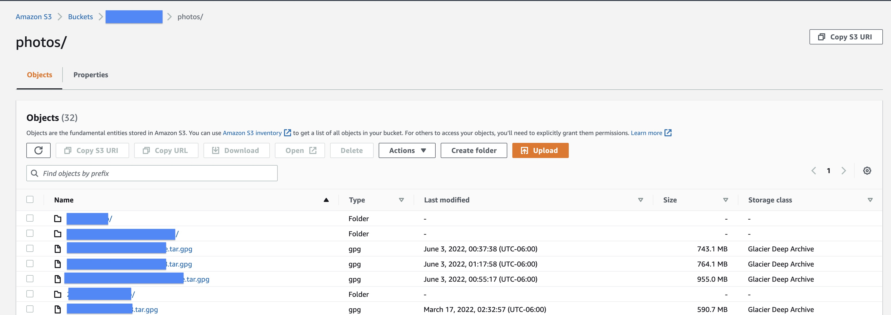
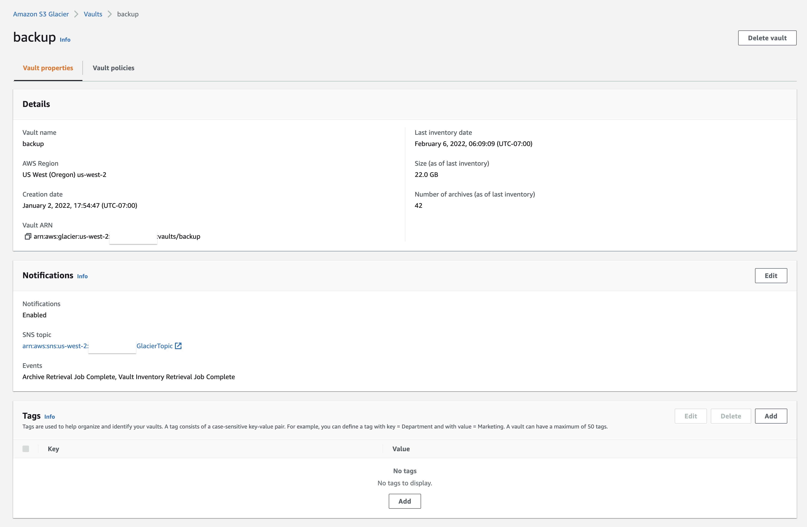

## AWS S3 Glacier Deep Archive vs. AWS Glacier API-Only
- AWS S3 Glacier Deep Archive is a newer and improved version of AWS Glacier and it is also cheaper compared to other AWS Glacier services including AWS Glacier API-Only
- In addition to explaining how to create an AWS S3 Bucket for AWS S3 Glacier Deep Archive, the next section also explains how to create an AWS Vault for AWS Glacier API-Only in case you have a need to create one. But, in general you should just go with **AWS S3 Glacier Deep Archive**, and therefore creating a **Bucket**, if you are tyring to decide between the two
- The documentation here won't go into the differences between the two AWS Glacier options, but at least AWS S3 Glacier Deep Archive and AWS S3in general offers the ability to browse the stored objects in the Buckets both through the web console and the CLI tools. That is not possible with AWS Glacier API-Only and Vaults
- Here are two screenshots that show what an AWS S3 Bucket and an AWS Glacier API-Only's Vault look like in the web console

### AWS S3 Bucket
   

### AWS Glacier API-Only Vault

